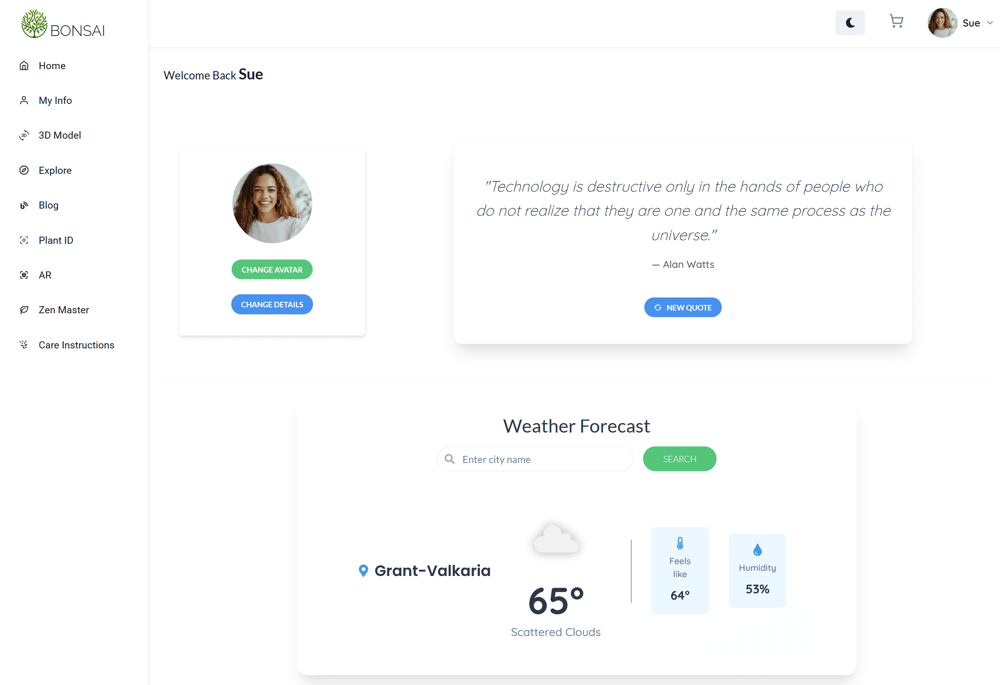
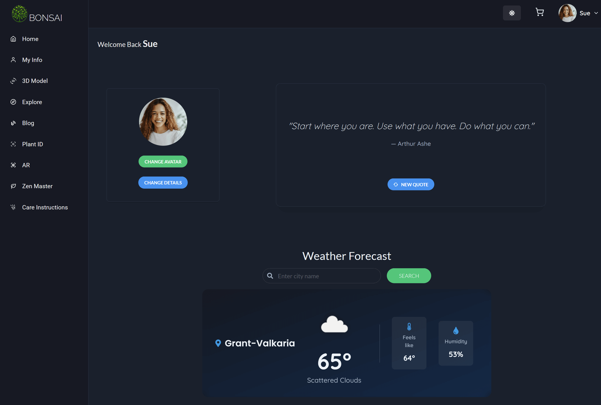
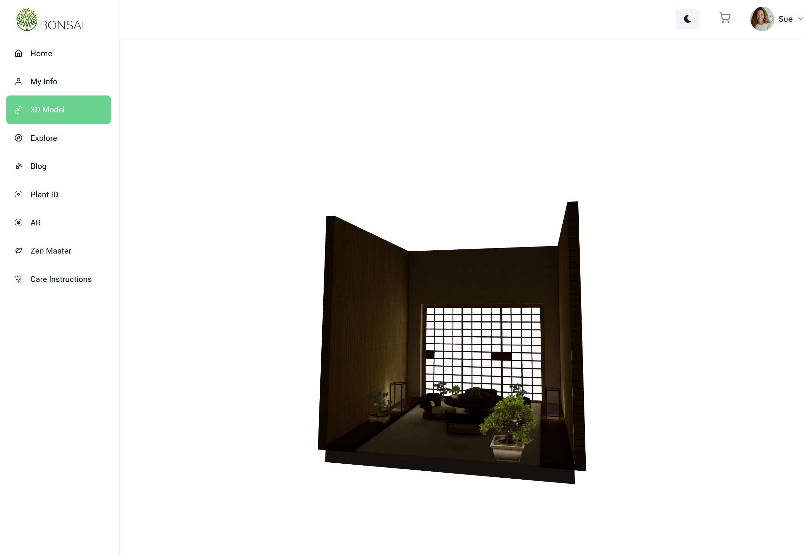
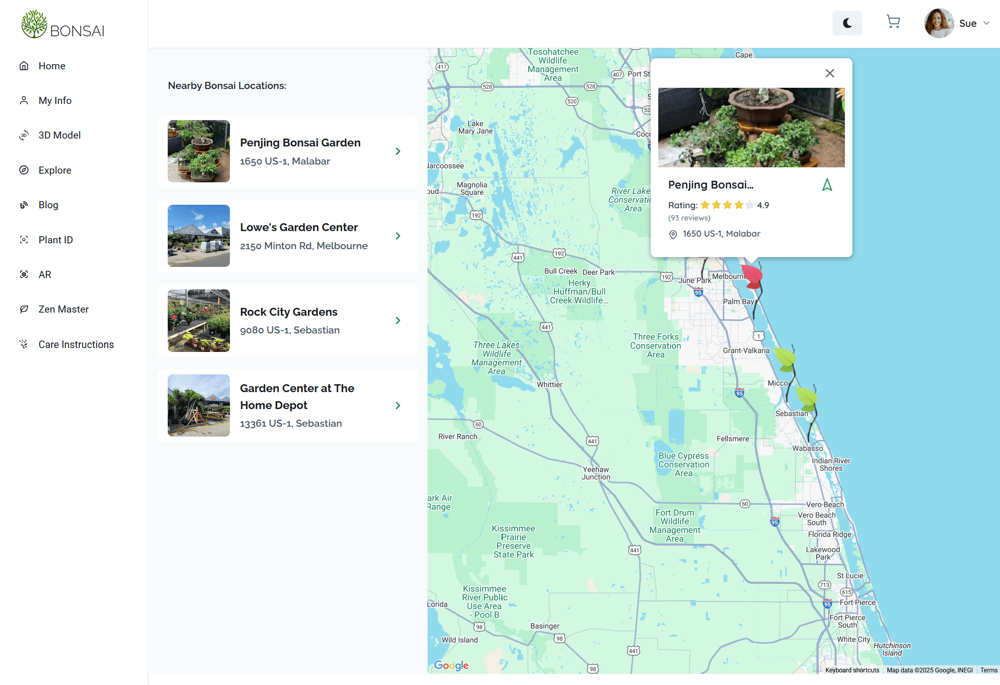
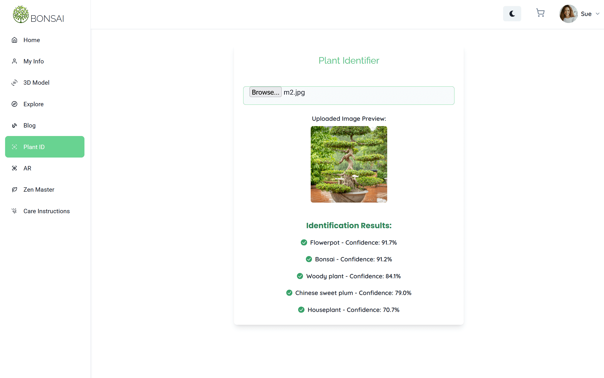
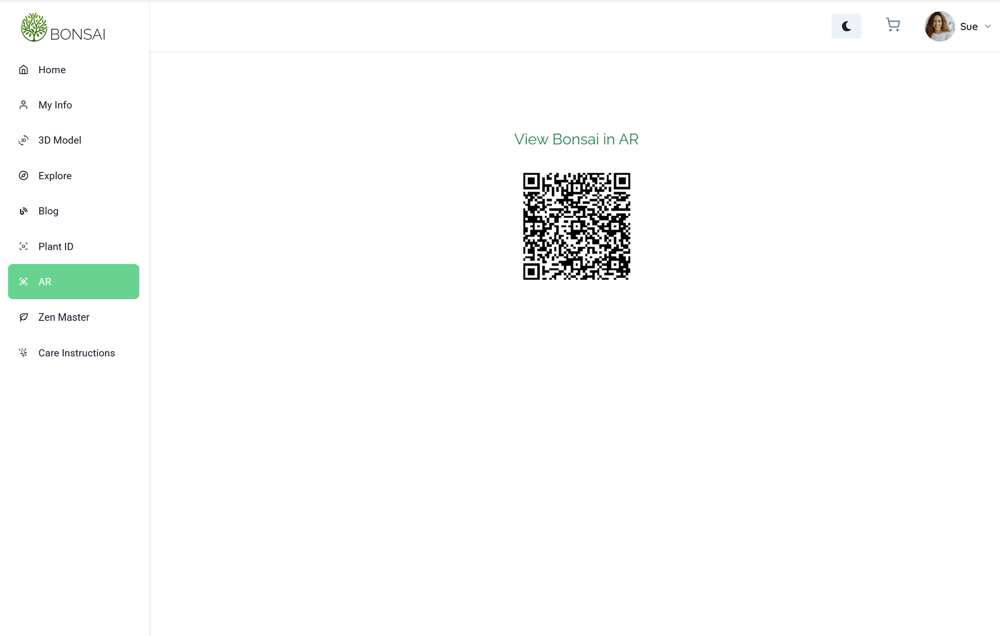
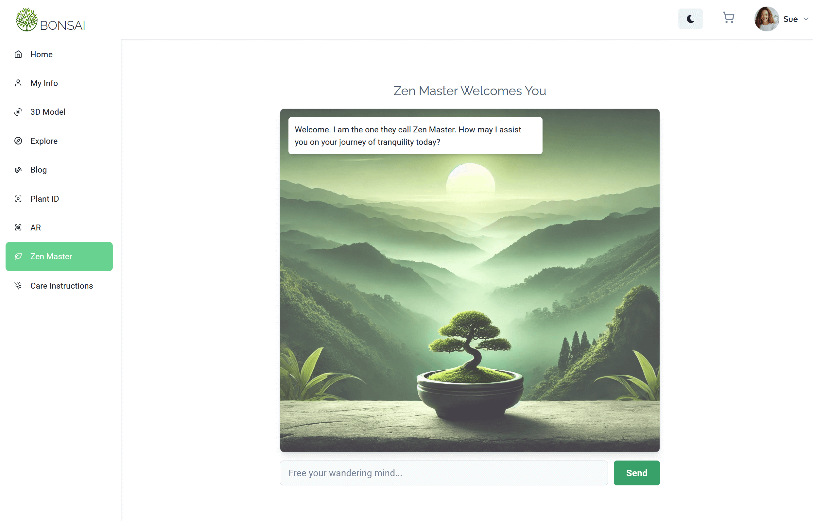

# Bonsai

<div align="center">
  
</div>

<br><br><br>

Welcome to Bonsai, a full-stack web application that offers a seamless eCommerce
experience for bonsai enthusiasts. The platform allows users to browse,
purchase, and explore curated bonsai plants, accessories, and information.

Bonsai combines cutting-edge technology with a tranquil design to create the
ultimate platform for bonsai lovers. Visit the live application at
<a href="https://www.mwbonsai.com" target="_blank" rel="noopener noreferrer">mwbonsai.com</a>.

---

### Built With

### Frontend


### Backend


### Third-Party APIs


## Features

- **Responsive Design:** Built with React and styled using Chakra UI for a
  beautiful and intuitive user experience across devices.
- **Interactive Components:** Includes an elegant shopping cart, dynamic product
  filtering, and search functionality.
- **PayPal API :** Secure payment API integration.
- **Weather API :** to check local conditions for optimal bonsai care.
- **Zen Quotes API :** to inspire users with peaceful quotes.
- **OpenAI API :** for an intelligent chatbot experience.
- **Weather API :** to check local conditions for optimal bonsai care.
- **Location Services:** Integration with Google Maps API to find nearby bonsai
  nurseries, gardens, and clubs.
- **3D and Augmented Reality:** View bonsai plants in 3D and Augmented Reality
  using Three.js, React Three Fiber and WebXR for a unique shopping experience.
- **Blog Integration:** Create, Read and interact with blog post on bonsai care,
  history, and art.

- **Django-Powered Backend:** A robust and secure API backend built with Django
  and Django REST Framework.
- **Image Management:** Efficient handling of product and user-uploaded images
  using AWS S3.
- **Payment Processing:** Integrated with PayPal API for seamless transactions.
- **Authentication:** Secure user authentication and authorization powered by
  JWT.

<table>
  <tr>
<br><br><br>


  </tr>

---

### User Dashboard

<div align="center">
  
  
</div>  
Personalized user dashboard with avatar updates, weather insights, and Zen quotes.

---

### Additional Interactive Features

<div align="center">
  
  
  
  
  
</div>  
Advanced 3D model interactions, augmented reality, google maps integration, plant ID, and more to enhance the user experience.

---

## Installation

### Prerequisites

- Node.js
- Python 3.9+
- PostgreSQL

### Clone the Repository

```bash
git clone https://github.com/mikhail-w/bonsai.git
```

### Frontend Setup

```bash
cd bonsai/frontend
npm install
npm run dev
```

### Backend Setup

1. Create and activate a virtual environment:

   ```bash
   cd bonsai/backend
   python -m venv venv
   source venv/bin/activate
   ```

2. Install dependencies:

   ```bash
   pip install -r requirements.txt
   ```

3. Set up the database:

   ```bash
   sudo -u postgres psql
   CREATE DATABASE bonsai_store;
   CREATE USER admin WITH PASSWORD 'password';
   ALTER USER admin WITH SUPERUSER CREATEROLE CREATEDB REPLICATION BYPASSRLS;
   ```

4. Apply Django migrations and load initial data:

   ```bash
   python manage.py makemigrations
   python manage.py migrate
   python manage.py loaddata users.json
   python manage.py loaddata products.json
   python manage.py loaddata posts.json
   python manage.py loaddata reviews.json
   python manage.py loaddata comments.json
   ```

5. Run the server:
   ```bash
   python manage.py runserver
   ```

---

## Deployment

Bonsai is deployed on AWS using the following services:

- **Frontend:** Hosted on AWS S3 with CloudFront for content delivery.
- **Backend:** Deployed on an EC2 instance with Nginx and Gunicorn.
- **Domain:** Registered with AWS Route 53 and configured to support HTTPS.

---

## Contribution

We welcome contributions to Bonsai! Follow these steps to get started:

1. Fork the repository.
2. Create a new branch for your feature or bug fix:
   ```bash
   git checkout -b feature/your-feature-name
   ```
3. Commit your changes and push them to your fork.
4. Open a pull request.

---

## License

This project is licensed under the [MIT License](./LICENSE).

---

## Acknowledgments

Special thanks to the team and contributors who made this project possible!

<table>
  <tr>
    <td align="center">
      <a href="https://github.com/GD757">
        
        <br />
        <sub><b>Gary Dunnington</b></sub>
      </a>
    </td>
    <td align="center">
      <a href="https://github.com/DustinV1976">
        
        <br />
        <sub><b>Dustin Siebold</b></sub>
      </a>
    </td>
    <td align="center">
      <a href="https://github.com/dp1p">
        
        <br />
        <sub><b>Daniel Phanachone</b></sub>
      </a>
    </td>
  </tr>
</table>
